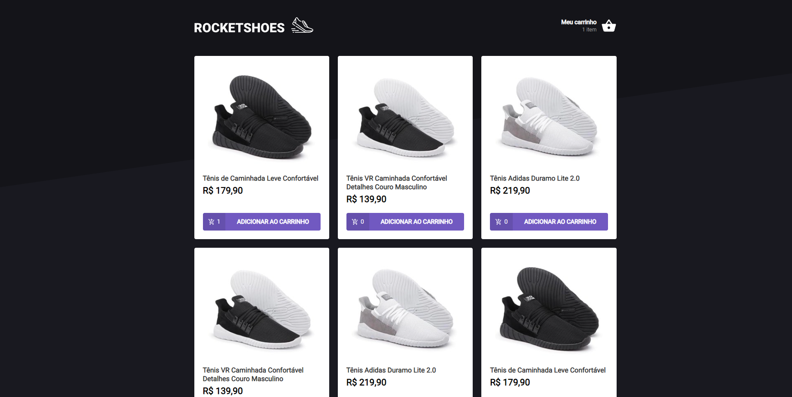

---

## Sobre 

O objetivo do projeto é criar um hook para gerennciar um carrinho de compras.

--- 

## 📽️ Imagem do projeto 




--- 

## 💻 Pré-requisitos

Antes de começar, verifique se você atendeu aos seguintes requisitos:
* Você tem uma máquina `<Windows / Linux / Mac>`


## ⚙️ Instalando

Para instalar execute no terminal:

yarn:
```
yarn install
```

## 🚀 Rodando o projeto

Para rodar o projeto, execute no terminal:

yarn:
```
yarn server (executar o servidor da api)
yarn start (executar o programa)
yarn test (realizar os testes)
```

## 🚀 Tecnologias utilizadas

O projeto está desenvolvido utilizando as seguintes tecnologias:
	
- 
- 
- 

--- 


